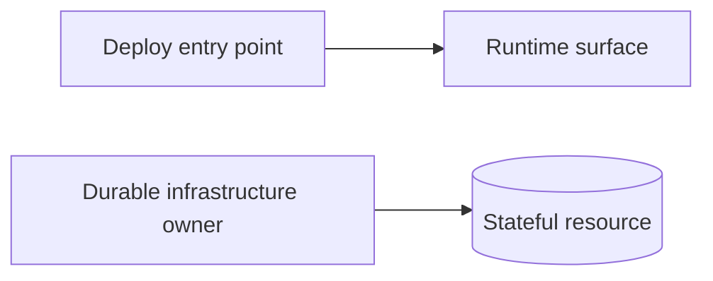

# {{System Name}}

**Truth state:** shipped | partial | aspirational

> One paragraph: what this system is, why it exists, and what it is _not_.

## Architecture

## Infrastructure / deployment

## Key invariants

- Invariant 1 — what must always be true.
- Invariant 2 — what must never be true.

## Interfaces

| Consumer | Entry point | Contract |
| -------- | ----------- | -------- |
|          |             |          |

## Failure modes

| Failure | Blast radius | Detection | Recovery |
| ------- | ------------ | --------- | -------- |
|         |              |           |          |

## Evolution

- Known next steps
- Blueprints that extend this system
- ADRs that decided a non-obvious choice here

## Related

- `docs/runbooks/` — operational procedures
- `docs/adrs/` — decision records
