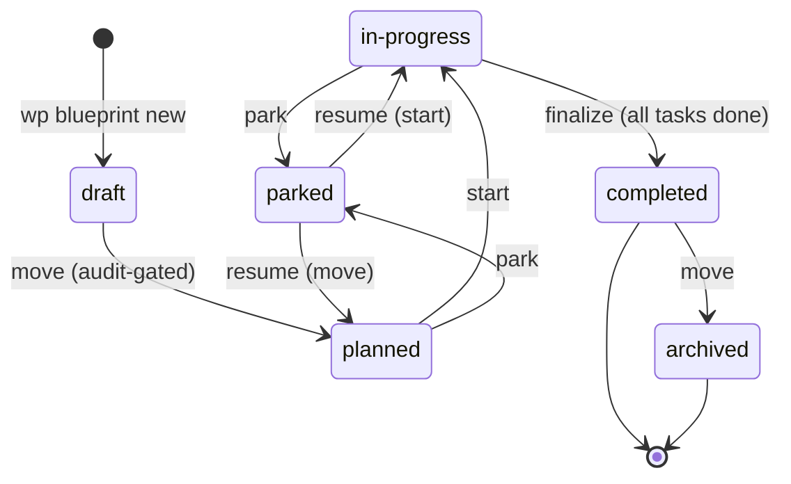
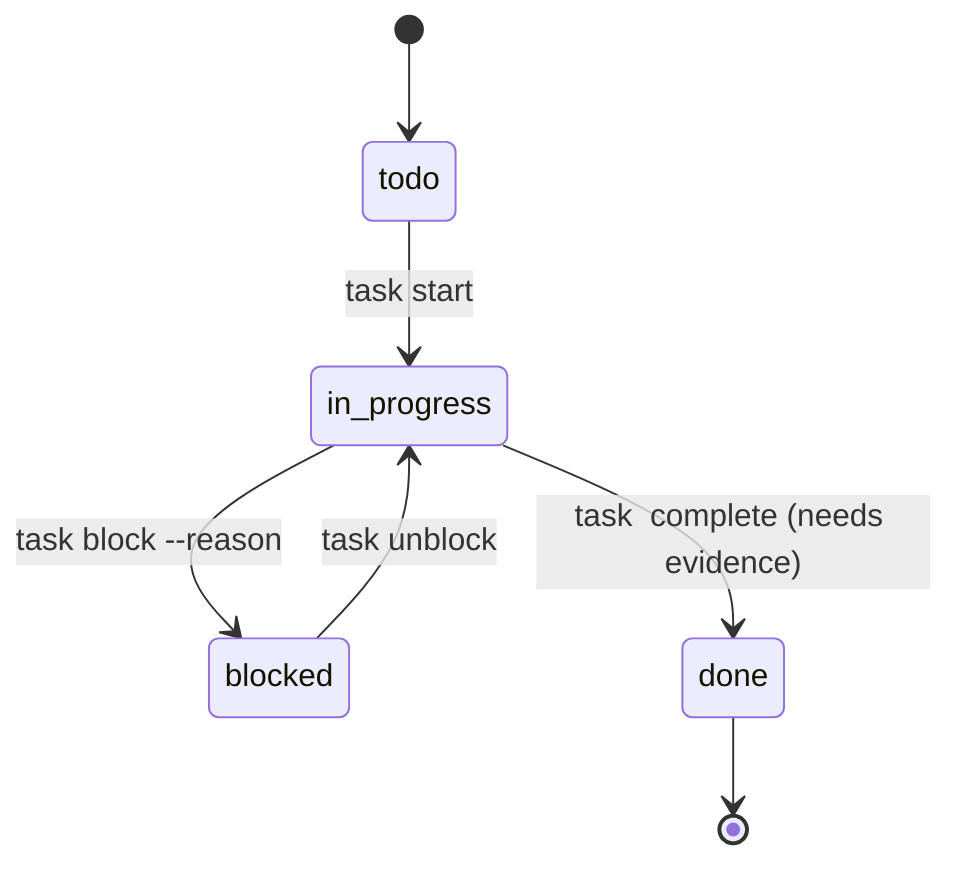
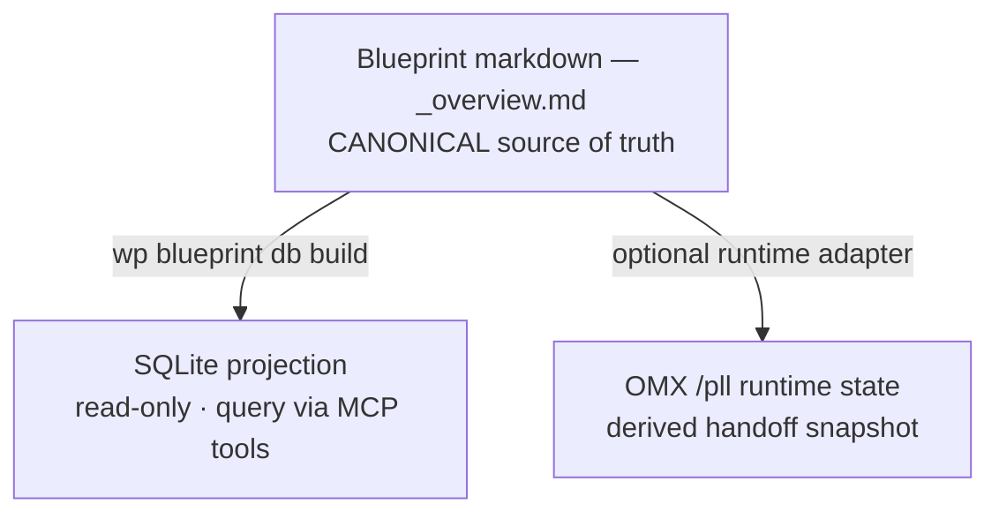

# Blueprint lifecycle

A blueprint is a Markdown + YAML-frontmatter implementation plan that
moves through a handful of discrete states. The state machine is
deliberately small — it's more important that it be enforced than that
it have lots of transitions.

## States

| State | Directory | Semantics |
|---|---|---|
| `draft` | `blueprints/draft/<slug>/` | Freshly created. Still being scoped. May reference unverified claims. Not ready to execute. |
| `planned` | `blueprints/planned/<slug>/` | Refined, fact-checked, task graph ready. Can be picked up by an agent. Tasks haven't started. |
| `in-progress` | `blueprints/in-progress/<slug>/` | At least one task has started. Progress tracked in `_overview.md` frontmatter (`progress:` field) and via per-task `**Status:**` annotations. |
| `completed` | `blueprints/completed/<slug>/` | Every task marked `done`. Acceptance criteria ticked. Ready for archival. |
| `archived` | `blueprints/archived/<slug>/` | Historical record. Read-only. |
| `parked` | `blueprints/parked/<slug>/` | Paused indefinitely. Reason captured in frontmatter. Resumes into `planned/` or `in-progress/`. |

## Transitions

Read it as: a blueprint is born in `draft`, gets refined to `planned`, runs as
`in-progress`, and ends in `completed` → `archived`. `parked` is the side track
for work paused mid-flight.



Rules:

- **`draft → planned`** requires the plan pass format audit (`wp blueprint audit <slug> --strict`) and ideally `/plan-refine`. Enforced by `wp blueprint move <slug> planned` — the move command refuses if the audit fails.
- **`planned → in-progress`** is automatic on `wp blueprint start <slug>` or when an agent calls `wp blueprint task <slug> <task-id> start`. Don't manually move between these two states.
- **`in-progress → completed`** requires every task's checklist ticked and frontmatter `status: completed` set. `wp blueprint finalize <slug>` validates and transitions.
- **`completed → archived`** is manual (`wp blueprint move <slug> archived`) and signals "this historical record should stay but isn't referenced by active work."
- **`→ parked`** can happen from `planned` or `in-progress` (`wp blueprint move <slug> parked`). Frontmatter gains a `parked_reason:` field.
- **`parked → planned`** / **`parked → in-progress`** is the resume path. `completed` and `archived` are terminal — the lifecycle engine refuses to move out of them.

## Frontmatter fields

Minimum required:

```yaml
---
type: blueprint
status: draft        # draft | planned | in-progress | completed | archived | parked
complexity: M        # XS | S | M | L | XL — t-shirt sizing
created: 2026-04-22
last_updated: 2026-04-22
progress: '0% (0 of N tasks completed)'
---
```

Optional (common):

```yaml
depends_on:
  - name-of-other-blueprint
  - >-
    name-of-other-blueprint (planned) — note about why this is a dependency
tags:
  - infra
  - cloudflare
parked_reason: >-
  Waiting on upstream decision about <X>. Resume when <Y> lands.
completed_at: 2026-04-22
# execution_backend is omitted for the package-core lifecycle; optional runtimes may set their adapter name
max_parallel_agents: 3
```

`complexity` is enforced:

- **XS** — single-session one-liner; often just a config change.
- **S** — one focused chunk of work; ≤ 1 dev-day.
- **M** — 2–5 phases, multiple tasks per phase.
- **L** — cross-cutting. Multiple packages touched.
- **XL** — needs to be broken down further. Usually a sign the blueprint should become a parent roadmap with child blueprints.

## Task shape

Each task lives under a phase heading (`### Phase N: <name>`):

```markdown
#### [lane] Task 1.1: Short imperative name

- [ ] **Status:** todo | in_progress | blocked | done
- **Depends on:** — | Task 1.2 | Task 1.2, Task 2.3
- **Files:** path/to/file.ts, path/to/other.ts
- **Change:** one-liner describing the delta.
- **Verify:** the command that proves it worked.
- **Acceptance:** the observable outcome that closes the task.
```

A task moves through its own small state machine, independent of the
blueprint's state. A blueprint flips to `in-progress` as soon as the first task
leaves `todo`, and to `completed` only when every task reaches `done`.



Rules (enforced by the `blueprint-plan` docs-linter validator at
`webpresso/docs-linter`):

- Task headings use **four** hashes (`####`), not three.
- Task IDs are numeric dotted (`1.1`, `1.2a`, `2.3.1`), never bare.
- Dependencies use the `Task X.Y` form, not bare `X.Y`.
- Executable blueprints (`status: planned|in-progress|completed`) must
  use canonical task statuses only: `todo | in_progress | blocked | done`.
- Every executable task must include explicit `**Status:**`.
- `in_progress → done` requires recorded evidence (`wp blueprint task <slug>
  <id> verify`); the engine refuses to complete a task without it.

## Blueprint scoping rule

Per `.agent/rules/blueprint-scoping.md` (in the webpresso catalog):

> New blueprints that extend or replace enabling-layer infrastructure
> (runtime, schema engine, agent fabric, session DOs, policy engine,
> workflow runner) MUST name a product-wedge in the current VISION stage
> that directly consumes the new capability. Blueprints without that
> anchor stay in `draft/` or move to `archived/`.

Infra blueprints either anchor to a user-visible capability or wait.
This keeps the backlog honest.

## Common operations

```bash
wp blueprint new "<goal>" --complexity M        # create draft
wp blueprint list                                # all statuses
wp blueprint list --status planned               # filter
wp blueprint show <slug>                         # detail view
wp blueprint audit <slug> --strict               # format + lifecycle check
wp blueprint audit --all --strict                # everything
wp blueprint move <slug> planned                 # transition (audit-gated)
wp blueprint start <slug>                        # planned → in-progress
wp blueprint task <slug> 1.1 start               # task → in_progress
wp blueprint task <slug> 1.1 complete            # task → done
wp blueprint task <slug> 1.1 block --reason "<why>"
wp blueprint task <slug> 1.1 unblock
wp blueprint finalize <slug>                     # all tasks done → completed
wp blueprint move <slug> archived                # keep record
wp blueprint logs <slug>                          # audit-event history
```

The `wp_blueprint_depgraph` MCP tool returns a blueprint's dependency graph as
structured `nodes` + `edges` (read from the SQLite projection, including
cross-repo edges).

## Canonical state vs derived state (OMX, SQLite)

The committed markdown `_overview.md` remains the persisted project record, but
the **canonical public authoring surface** is now the structured MCP mutation
path (`wp_blueprint_put` for whole-document writes and
`wp_blueprint_transition` for lifecycle moves). Everything else is a derived
view. Raw markdown helper APIs are intentionally not part of the public control
plane.



- **SQLite projection** — a queryable mirror of the markdown for agents (see
  the SQLite section below). Derived; rebuilt with `wp blueprint db build`.
- **OMX runtime state** — when the optional OMX `/pll` adapter runs a blueprint,
  it keeps its own runtime snapshot (mapping each task's `todo|in_progress|
  blocked|done` to OMX team-task status). It is a handoff/derived layer, not
  required for the public package core: Agent Kit exposes the Blueprint DAG and
  lifecycle primitives, and runtime-specific adapters such as OMX consume them.

If a derived view and the persisted markdown ever disagree, the persisted
markdown wins — rebuild the view rather than editing it. Authoring updates
should flow through the structured `wp_*` blueprint mutation tools, not direct
raw-markdown helper APIs.

## MCP Apps editor follow-on (v2)

The blueprint editor UI is intentionally a **follow-on enhancement**, not part
of the v1 correctness path.

- The canonical authoring contract remains `wp_blueprint_put` for whole-document
  writes and `wp_blueprint_transition` for lifecycle moves.
- A future MCP Apps editor must sit on top of those structured mutation tools
  rather than introducing a parallel markdown-writing control plane.
- Hosts that do not support MCP Apps must still be able to complete the full
  authoring flow through the structured `wp_*` blueprint tools alone.
- The minimum editor contract is:
  - detect MCP Apps capability before presenting the UI path
  - edit the structured blueprint document, not raw markdown fragments
  - fall back cleanly to `wp_blueprint_put` / `wp_blueprint_transition` when UI
    support is missing

## SQLite projection

Run `wp blueprint db build` after any lifecycle state change to keep the SQLite
projection in sync with the markdown on disk. Agents can query it directly via
MCP tools (see `docs/blueprint-db-cookbook.md` for the nine pre-registered query
templates, e.g. `next-ready-task`).

```bash
wp blueprint db build    # rebuild after state changes
wp blueprint db verify   # confirm DB matches markdown (suitable for CI)
wp blueprint db browse   # open Datasette UI for human exploration
```
